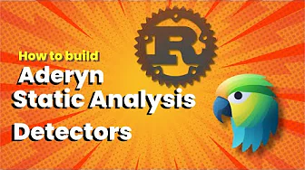
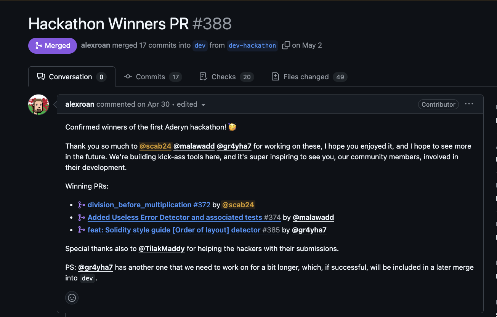
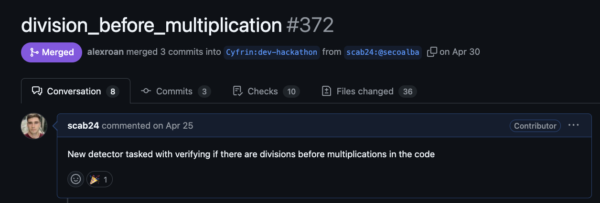
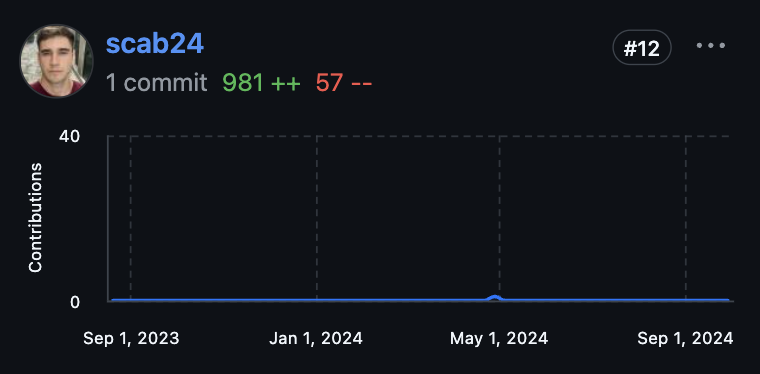

# Contribution to Static Analysis Tool Aderyn
## Hackathon Winner

## New Detectors Added:

### Additional References:

  
  

| Detector Name                         | Description                                                      |
|---------------------------------------|------------------------------------------------------------------|
| [division_before_multiplication](https://github.com/Cyfrin/aderyn/blob/dev/aderyn_core/src/detect/low/division_before_multiplication.rs)               | Incorrect Order of Division and Multiplication |

You can view the commit containing these detectors [here](https://github.com/Cyfrin/aderyn/pull/388).

