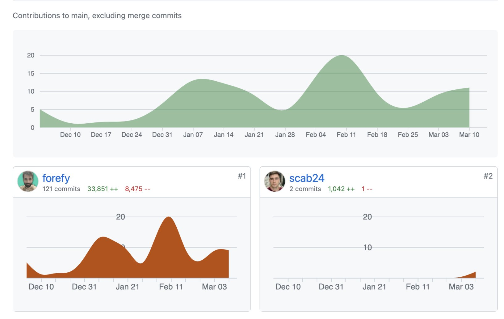

# Contribution to Static Analysis Tool eBurger

## New Detectors Added:

### Additional References:

  
  

| Detector Name                         | Description                                                      |
|---------------------------------------|------------------------------------------------------------------|
| [Use of SafeTransferLib](https://github.com/forefy/eburger/blob/main/eburger/templates/use_of_safetransferlib.yaml)               | Detects the usage of SafeTransferLib for secure token transfers. |
| [Use of encodedPacked with Dynamic Data Types](https://github.com/forefy/eburger/blob/main/eburger/templates/use_of_encodepacked.yaml) | Identifies the use of encodedPacked with dynamic data types.     |
| [Unspecific Solidity Pragma Detector](https://github.com/forefy/eburger/blob/main/eburger/templates/unspecific_pragma_detector.yaml)   | Detects the presence of unspecific Solidity pragma directives.    |
| [unverified_from_address_in_transfer](https://github.com/forefy/eburger/blob/main/eburger/templates/unverified_from_address_in_transfer.yaml)  | Detects unverified from addresses in transfer operations.         |

You can view the commit containing these detectors [here](https://github.com/forefy/eburger/commit/32594e64500837bbc7ba93b6555287d45cf52a37).

