## [Autonolas](https://github.com/scab24/Autonolas)


# Installation

To be able to use this repository, you need to have the following installed:

- Foundry
 -  https://book.getfoundry.sh/getting-started/installation
- Halmos
 -  https://github.com/a16z/halmos/tree/main
- Echidna
 -   https://github.com/crytic/echidna?tab=readme-ov-file#installation
- Medusa
 - https://github.com/crytic/medusa?tab=readme-ov-file#installation
- Ityfuzz
 - https://docs.ityfuzz.rs/installation-and-building
- Blazo
 - https://github.com/fuzzland/blazo

# Init:

```js
 git submodule update --init --recursive
```
```js
sudo forge build -force
```

  
# Tools used:


## Foundry

### Explanation
We have been conducting fuzzing tests and invariant tests to verify the proper functionality of the contract.

### - OLASTest

```
forge test --mc OLASTest
```

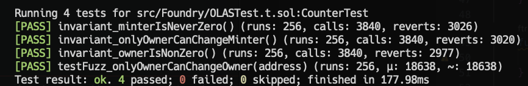

### - veOLASTest

```
forge test --mc veOLASTest
```
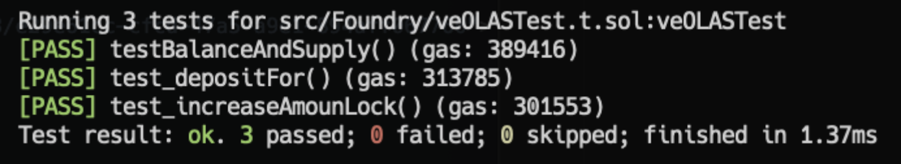


##  Halmos 


To successfully run the tests, it is necessary to have Foundry and Halmos installed.
In these contracts, we have employed fuzzing techniques combined with formal verification in order to conduct a much more exhaustive and higher-quality analysis, leveraging their significant advantages over using just a fuzzer.

### - HalmosOLAS

### Explanation

In this contract, we have utilized:

- A contract as the foundation for the tests, employing cheatcodes provided by Halmos to create users and random amounts distributed among them in a hierarchical structure.

- A second contract in which we have written all the test logic for the code we have tested:

  ```
  halmos --contract HalmosOLAS --solver-timeout-assertion 0
  ```

  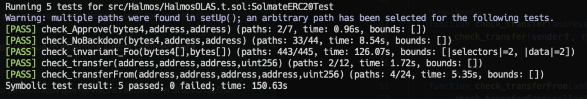
   


### - HalmosveOLAS

### Explanation

In this contract, we have utilized:

- A contract as the foundation for the tests, employing cheatcodes provided by Halmos to create users and random amounts distributed among them in a hierarchical structure.

```
sudo halmos --contract HalmosveOLAS --solver-timeout-assertion 0
```

- A second contract in which we have written all the test logic for the code we have tested:
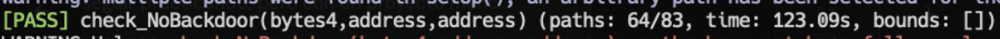


## Echidna

### - EchidnaOLAS

```
echidna src/Echidna/EchidnaOLAS.sol --contract EchidnaOLAS
echidna . --contract EchidnaOLAS
```

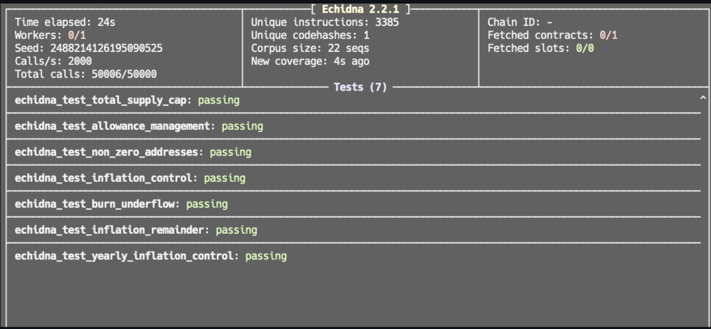


### - EchidnaOLASAssert

```
echidna src/Echidna/EchidnaOLASAssert.sol --contract EchidnaOLASAssert --test-mode assertion
echidna . --contract EchidnaOLASAssert --test-mode assertion
```

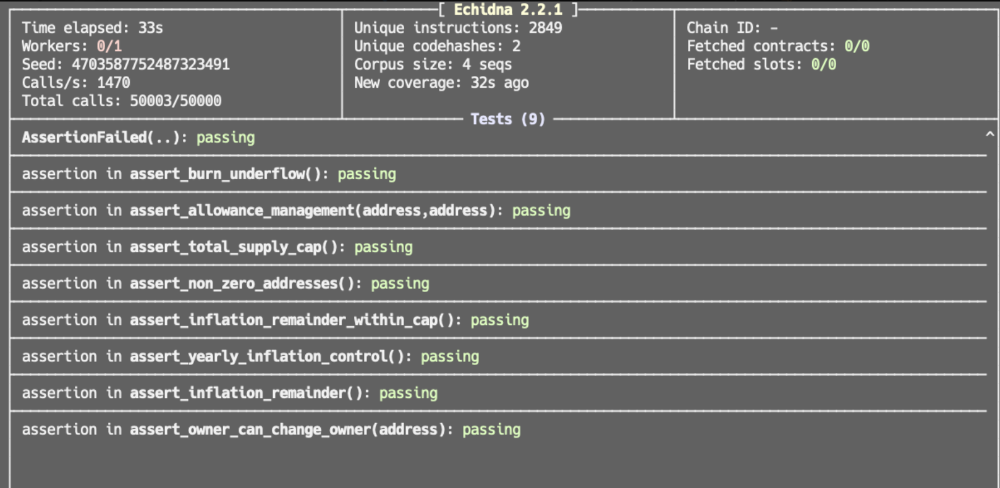


### - EchidnaVeOLASAssert

```
echidna src/Echidna/EchidnaVeOLASAssert.sol --contract EchidnaVeOLASAssert --test-mode assertion
echidna . --contract EchidnaVeOLASAssert --test-mode assertion
```

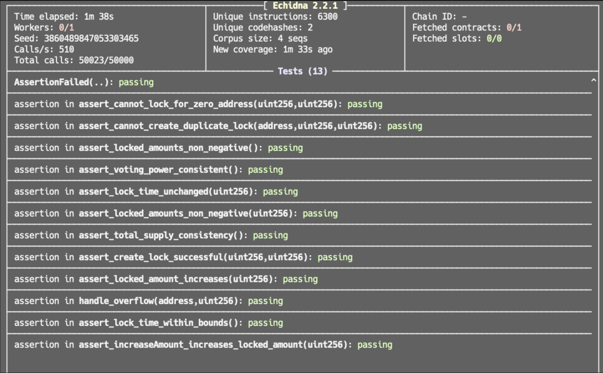


## Medusa

### EchidnaOLASAssert

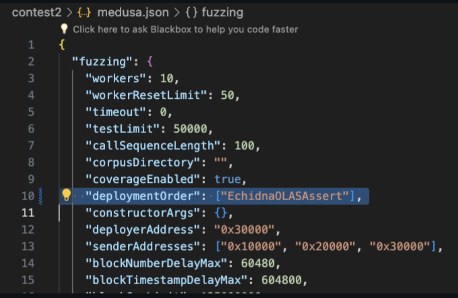


```
medusa fuzz
```

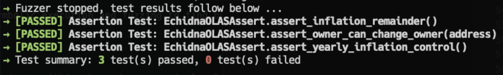


### EchidnaVeOLASAssert

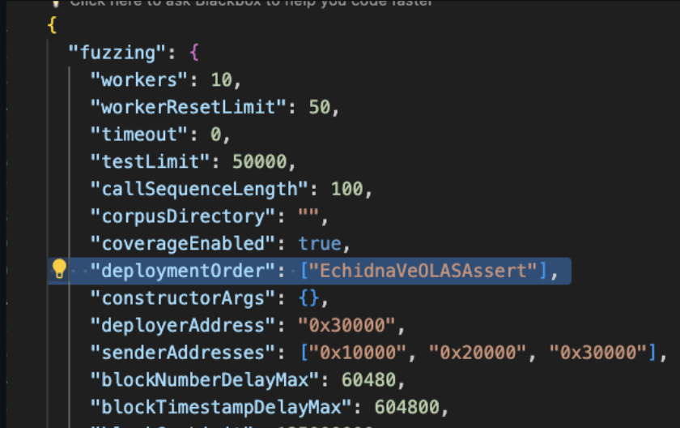


```
medusa fuzz
```

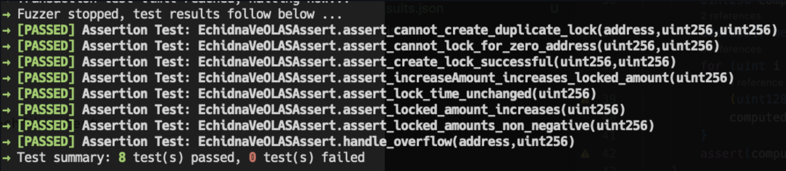


## Ityfuzz

### Explanation

ItyFuzz is a blazing-fast EVM and MoveVM smart contract hybrid fuzzer that combines symbolic execution and fuzzing to find bugs in smart contracts offchain and onchain.

We have utilized the ityfuzz tool in various ways:
- One approach involved using the "bug()" keyword to intentionally break specific invariants within the code at particular locations.
- Another method was to integrate it within the existing assert tests of Echidna since the tool itself operates within it, aiming to enhance its capabilities by applying formal verification within the Echidna fuzzer.

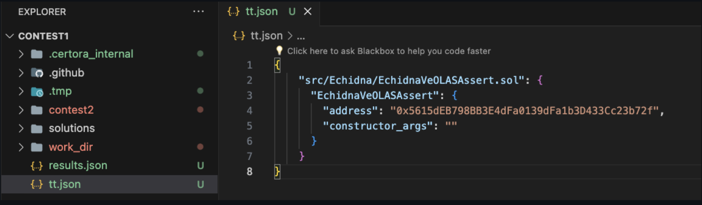


```
sudo blazo contest2
```
```
ityfuzz evm --builder-artifacts-file './results.json' --offchain-config-file './tt.json' -t "a" -f
```


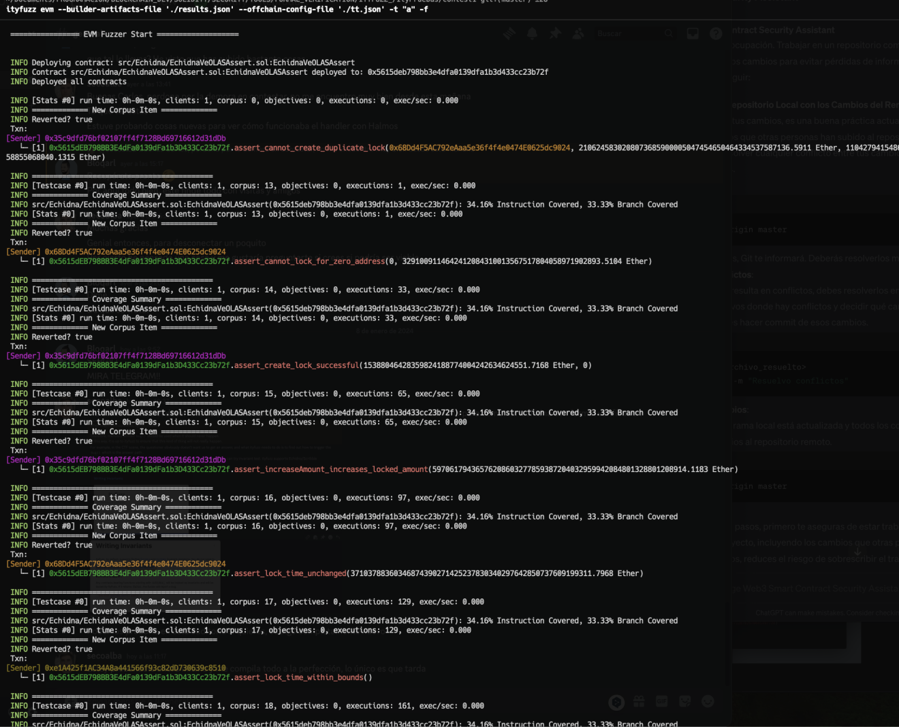


